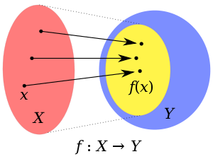

# 함수
## 함수의 정의
$f:A \to B \space function \space if \space \forall a \in A, \space \exists! b \in B $

$A$는 집합이며 $f$의 __정의역__ 이라 한다.
$B$는 집합이며 $f$의 __공역__ 이라 한다.
$f(x)$의 집합을 __치역__ 이라 한다.

$a_1 = a_2 \to f(a_1) = f(a_2)$
$ f(a_1) \ne f(a_2) \to a_1 \ne a_2$

## 단사(injective) 함수 (일대일 함수)
$f:A \to B \space injective \space ft \space if$
$a_1 \ne a_2 \to f(a_1) \ne f(a_2)$
$f(a_1) = f(a_2) \to a_1 = a_2$

정의역의 서로 다른 원소를 항상 공역의 서로 다른 원소와 대응시키는 함수

## 전사(surjective) 함수
$f:A \to B \space surjective \space ft \space if $
공역과 치역이 같은 함수

## 전단사(bijective) 함수
$f:A \to B \space bijective \space ft \space if$
전사 + 단사

## 항등(identity) 함수
$f:A \to B \space identity \space ft \space if$
$f(a) = a, \space \forall a \in A$
어떤 변수도 자기 자신을 함수값으로 하는 함수
$identity \space ft \equiv  I_A$

## 합성(composite) 함수
$def \space f:A \to B, \space f:B \to C \space composite \space ft \space if$
$g \circ f(a) = g(f(a)), \space \forall a \in A $

함수가 합성될려면 $f$의 공역이 $g$의 정의역과 일치해야 한다.

## 역(inverse) 함수
$
\begin{aligned}
&Thm \space f:A \to B \space bijective \\
&\iff \exists f^{-1}B \to A \space : \space inverse \space ft \space of \space f \\
&\iff f \circ f^{-1} = I_B \\
&\iff f^{-1} \circ f = I_A \\
&\end{aligned}
$

### 역함수 구하는 방법
$
\begin{aligned}
&step1 \space check \space f:bijective \\
&step2 \space x \rightleftharpoons y \\
&step3 \space Solve \space for \space y \\
\end{aligned}
$
