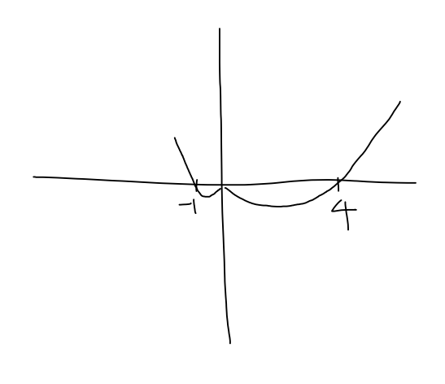

# 다항식과 그래프
## n차 정함수(n-th polynomial)
$Def. \space P_n(x) = a_0 + a_1x + a_2x^2 + ... + a_nx^n \space (a_1 \ne 0) \space draw \space graph$

## 1차 (정)함수
$Def. \space f(x) = ax + b \space (a \ne 0)$
$a$: 기울기, $b:y$ 절편, $-\frac{b}{a}:x$ 절편

### 1차 함수 방정식 구하는 방법
+ $Given \space m, \space (x_1, y_1) \in l$
$\implies \: y - y_1 = m(x - x_1)$

+ $(x_1, y_1), \space (x_2, y_2) \in l$
$\implies l:y - y_1 = \dfrac{y_2 - y_1}{x_2 - x_1}(x - x_1)$

+ $Given \space m, \space b$
$\implies l:y=mx + b$

### 직선의 일반형
$Def. \space ax + by + c = 0$
$m = -\frac{a}{b}$
$x$ 절편 $= -\frac{c}{a}$
$y$ 절편 $= -\frac{c}{b}$

### 두 직선의 평행과 수직(직교)
$Thm \space Let. \space m : l_1$의 기울기, $m_2 : l_2$의 기울기
$
\begin{aligned}
&1)l_1 \parallel l_2 \iff m_1 = m_2 \\
&2)l_1 \bot l_2 \iff m_1 m_2 = -1 \iff \alpha \cdot \beta = 0 \\
\end{aligned}
$

## 우함수와 기함수
+ 우함수 - y축에 대칭인 함수
$Def. \space f: even\space ft \space if \space f(-x) = f(x) \space for \space all \space x$

+ 기함수 + 원점에 대칭인 함수
$Def. \space f: odd \space ft \space if \space f(-x) = -f(x) \space for \space all \space x$

## $y=f(x)$의 그래프 이동
1. 수평이동 $: c \implies y = f(x - c) $
2. 수직이동 $: c \implies y -c = f(x) $
3. $x - reflection : -y = f(x) $
4. $y - reflection : y = f(-x) $

## 2차 (정)함수
### 정의
$f(x) = ax^2 + bx + c (a \ne 0)$

### 그래프
+ 꼭지점
$
\begin{aligned}
&y = ax^2 + bx + c \\
&= a(x^2 + \frac{bx}{a}) + c \\
&= a(x^2 + \frac{b}{2a} + \frac{b^2}{4a^2}) + c - a(\frac{b^2}{4a^2})\\
&= a(x + \frac{b}{2a})^2 - \frac{b^2 - 4ac}{4a} \\
&(- \frac{b}{2a}, \frac{b^2 - 4ac}{4a}) \\
\end{aligned}
$

### 근의 개수 판별식(x 절편의 개수)
판별식: $D = b^2 - 4ac$

+ $D > 0 \implies$ 서로 다른 근 2개
+ $D = 0 \implies$ 중근
+ $D < 0 \implies$ 근이 없음

## n차 정함수의 그래프 그리기
$f(x) = x^2(x-4)(x+1) \space graph?$
1. x절편, y절편 찾기
x 절편 - 0, 4, -1
y 절편 - 0

2. x절편으로 x축을 여러 개의 구간으로 나누어 그래프가 x축 위 또는 아래로 놓이게 한다.
$x > 4 \implies f(x) > 0$ - 양수x양수x양수
$0 < x < 4 \implies f(x) < 0$ - 양수x음수x양수
$-1 < x < 0 \implies f(x) < 0 $ - 양수x음수x양수
$x < -1 \implies f(x) > 0$ -양수x음수x음수

## 점근선(asymptote)
함수의 점근선은 직선으로서 함수의 __그래프의 어떤 부분이 접하지는 않으나 점점 가까워지는 것을 의미__
+ 수평점근선
$\lim\limits_{x\to\infty}R(x) \to L \space or \space \lim\limits_{x\to-\infty}R(x) \to L$
+ 수직점근선
$\lim\limits_{x \to c}|R(x)| = \infty \space \leftrightharpoons \space x = c$
+ 사선점근선
수평점근선도 아니고 수직점근선도 아닌 점근선

## 유리함수의 점근선
### 유리함수
다음과 같이 분모와 분자가 정함수이고 분모가 영함수가 아닌 함수
$R(x) = \dfrac{P_n(x)}{P_m(x)}$

### 점근법
$R(x) = \dfrac{P_n(x)}{P_m(x)} = \dfrac{a_nx^n + {a_{n-1}}^{n-1} ... a_1x + a_0}{b_mx^m + {b_{m-1}}^{m-1} ... b_1x + b_0}$
1. $P_m(c) = 0 \implies x = c:$ 수직점근법
2. $n < m \implies y = 0:$ 수평점근법
3. $m = n \implies y = \dfrac{a_n}{b_m}:$ 수평점근법
4. $n = m + 1 \implies$ 몫$:f(x)$인 사선점근선
5. $n > m + 1\implies$ $\nexists$사선점근선, $\nexists$수평점근선
