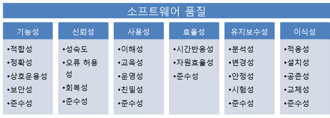

# 소프트웨어 공학이란
## 소프트웨어란
__프로그램 + 개발, 운영, 유지보수에 필요한 정보들의 집합__

## 소프트웨어의 특징
1. 비가시성
2. 복잡성
3. 순응성
4. 복제가능성

## 시스템
### 정의
__필요한 기능의 실현을 위해 관련 요소를 어떤 법칙에 따라 조합한 집합__

### 시스템의 성질
1. 서브 시스템 - 요소들이 밀접하게 연결
2. 기능의 분할 - 작은 시스템으로 나눌 수 있음
3. 시스템 경계 - 시스템은 주변 환경과 구분할 수 있는 경계
4. 자동화 경계 - 시스템이 자동화된 부분과 수동 작업 부분을 나누는 경계

## 소프트웨어 공학이란
__소프트웨어의 개발과 운영, 유지보수, 소멸에 대한 체계적인 접근 방법__

## 소프트웨어 공학의 필요성
1. 소프트웨어의 문제 해결
2. 고객의 요구를 실현
3. 소프트웨어를 잘 만들기 위해

## 고비용
+ 개발비보다 유지보수비가 더 높다.
+ 소프트웨어의 위기 - 시스템 대규모화에 따라 소프트웨어의 __신뢰성 저하__, __개발비의 증대__, __계획의 지연__ 등의 현상이 현저하여 __개발 계획의 수행을 매우 어렵게 만드는 상황__  
+ LOC(Lines Of Code) - 코드량  
+ MM(Man - Month) - 인건비  

## 유지보수의 필요성
1. 프로그램 오류 fix
2. 업그레이드

## 소프트웨어 개발의 문제점
고객의 요구를 파악하기 힘들다.

## 품질과 생산성
+ 비용 - MM
+ 일정 - 짧은 time-to-market
+ 품질 - ISO 9126

### 품질의 속성 설명
+ 기능성 - 설계된 기능을 제공하는 능력
+ 신뢰성 - 성능을 유지할 수 있는 능력
+ 사용성 - 쉽게 사용할 수 있는 디자인
+ 효율성 - 자원 대비 적절한 성능을 제공하는 능력
+ 유지보수성 - 쉽게 유지보수할 수 있는 능력
+ 이식성 - 다양한 환경에서 구동될 수 있는 능력

## 일관성과 재현성
+ 일관성 - 프로젝트의 결과를 예측하고 생상성을 향상시키기 위해 일관된 품질을 일관된 생상성으로 개발하는 것.
  ~~+ 재현성 - 개발하는 제품의 높은 품질과 생산성을 갖는 것~~

## 소프트웨어 공학의 접근 방법
소프트웨어를 개발하는 __프로세스__ 와 소프트웨어와의 분리

### 품질과 생산성을 결정하는 요인
+ 기술
+ 인력
+ 프로세스

### 소프트웨어 엔지니어링 작업의 종류
+ 소프트웨어 개발 프로세스 - 소프트웨어 제품을 개발하기 위한 과정 또는 구조
+ 품질보증 - 개발이 적질히 수행됨을 확인
+ 프로젝트 관리 - 개발과 품질보증 작업을 관리 감독

## 단계적 개발 프로세스
### 단계적 개발 프로세스를 사용하는 이유
+ 소프트웨어의 문제를 여러 개발단계에서 다른 관점으로 다루기 때문
+ 개발하는 동안 정해진 시점에서 품질과 진행을 체크 가능

### 요구분석 단계
__소프트웨어 시스템이 해결해야할 문제를 이해, 분석하여 요구를 정의__
+ 요구명세서(requirement specification): 시스템의 기능 이외에도 설계에 영향을 주는 모든 요인을 문서에 기술하는 것

### 설계 단계
__요구문서에 기술된 문제의 솔루션을 계획__

+ 아키텍처 설계 - 시스템의 각 컴포넌트의 상호작용에 초점
+ 상세 설계 - 각 모듈의 내부 논리를 작성

### 코딩 단계
__시스템 설계를 프로그래밍 언어로 변환__

### 테스팅 단계
__시스템의 결함을 찾아냄__

+ 프로그램에 포함된 요구, 설계, 코딩 오류를 찾아냄
+ 단위 테스팅 - 모듈과 컴포넌트를 개별적으로 시험
+ 통합 테스팅 - 모듈 사이의 연결을 시험
+ 민수 시험 - 고객을 사용하여 테스트

## 품질 보증
개발중인 소프트웨어가 요구와 품질 수준을 보장함을 확인하는 작업

+ 확인(verification)
    + 선택된 프로세스가 방법에 맞게 수행됨을 체크
    + 결과물이 품질 수준에 맞게 생산됨을 체크

+ 검증(vaildation) - 결과물의 정확성을 체크
    + 정적 검증 - 소프트웨어를 실행하지 않고 결과물의 정확성을 체크
    + 동적 검증 - 소프트웨어를 실행시켜 잘 작동하는지 체크
+ 테스팅
    + 동적 검증, 테스트 결과가 예상되는 결과와 일치하는지 체크

## 프로젝트 관리
__프로세스 이슈를 관리__
+ 작업 과정에서 자원을 어떤 작업에 할당할지 기술
+ 소프트웨어 계획은 프로젝트의 개발 프로세스를 모니터링하고 제어하는 기준이 됨

프로세스 관리 - 객관적인 데이터(소프트웨어 메트릭)가 필요하다.
+ 프로덕트 메트릭 - 개발한 제품, __소프트웨어 자체의 특성을 계량화__
+ 프로세스 메트릭 - 소프트웨어 개발에 사용된 __프로세스의 생산성(비용, 자원, 품질보증의 효과, 개발기법과 도구의 효율의 사항을 측정 등)  을 계량화__
