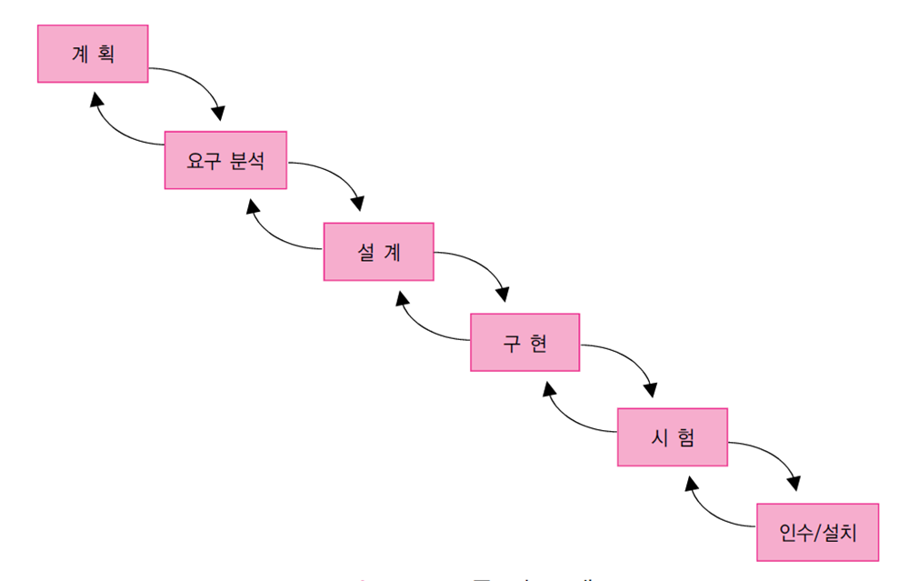
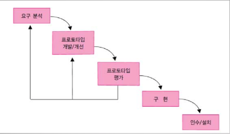
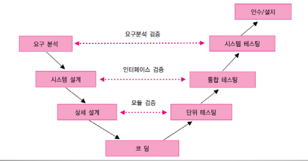
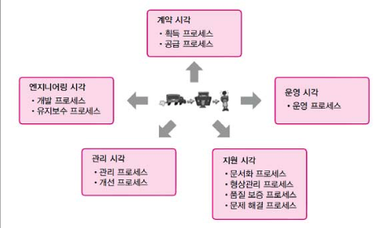
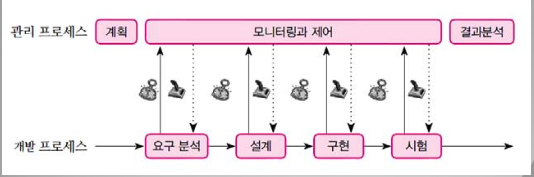

# 프로세스와 방법론
## 프로세스
__소프트웨어를 개발하는 작업 순서__
+ 순서제약이 있는 작업의 집합
+ 높은 품질과 생산성이 목표

프로세스가 없는 개발은? - Code And Fix

## 프로세스와 방법론의 비교
|  |프로세스|방법론|
|--|------|----|
|특징|단계적인 작업의 틀무엇을 하는가 각 단계를 다른 방법론으로 실현 가능|프로세스의 구체적인 구현 어떻게 하는가 각 단계의 절차, 기술, 가이드라인을 제시|
|사례|폭포수 프로세스 나선형 프로세스 ...|구조적 분석, 설계 방법론 객체지향방법론 ...|

## 프로세스 모델
소프트웨어 프로젝트
+ 프로세스를 이용
+ 비용, 일정, 품질에 대한 목표를 성취

프로세스 명세
+ 프로젝트에서 수행할 작업과 순서를 정의
+ 실행 프로세스는 다를 수 있음

프로세스 모델 - __일반적인 모델이 될만한 프로세스를 기술한 것__
+ 일반적인 프로세스를 기술
+ 작업의 단계와 순서
+ 각 단계에서 작업수행의 제약과 조건 등의 집합

## 프로세스의 종류
프로젝트의 중심 프로세스
+ 개발 프로세스
+ 관리 프로세스

기타 프로세스
+ 형상 관리 프로세스
+ 프로세스 관리 프로세스

## 프로세스의 정의
+ 작업결과와 검증결과를 명확히 정의해야함
+ 작업 방법
+ 진입조건, 출구조건

## 바람직한 프로세스의 특징
1. 예측가능성
2. 테스팅과 유지보수를 지원해야함
3. 변경 지원 - 수정이 용이
4. 결함 제거

## 단계별 프로세스 다시 정리
### 계획
+ 비용과 인원을 산정
+ 개발기간
+ 리스크 분석
+ 일정계획
+ 관리 전략 수립

### 요구 분석
+ 요구 - 시스템이 가져야 할 능력(capability)과 조건(condition)
+ 응용분야(도메인)에 집중
+ 가장 중요하고 어려운 단계
+ 결과물: 요구분석서(SRS)

### 설계
+ 솔루션에 집중
+ 아키텍처 설계
+ 데이터베이스 설계
+ UI 설계
+ 상세 설계
+ 결과물: 설계서(SD)

### 구현
+ 코딩과 단위 테스트
+ 특징
    + 압력 증가
    + 최고의 인력 투입

### 통합과 테스트
+ 통합해 나가면서 테스트
+ 모듈의 통합으로 시작
+ 통합은 개발자가 담당
+ 테스트는 QA팀이 담당
+ 단계적 테스트 - 단위, 통합, 시스템
+ 목적 중심 테스트 - 스트레스, 성능, 베타, Acceptance, Usability 테스트

### 설치와 유지보수
+ 시스템 타입에 따른 다른 설치 방법 제공
+ Migration 정책
+ 설치는 개발 프로젝트의 일부, 유지보수는 별개

#### 유지보수란
+ 결함을 고침
+ 새 기능 추가
+ 성능 향상

## 프로세스 모델 종류
### 폭포수 모델
각 단계를 순차적으로 작업한다.
+ 각 단계 사이에 중복, 상호작용 없음
+ 각 단계의 결과는 다음 단계가 시작 되기 전에 점검
+ 바로 전단계로 피드백

__결과물__ 정의가 중요

장점
+ 프로세스가 단순하다.
+ 중간 산출물이 명확하고 관리가 용이
+ 구현 전에 충분한 연구와 분석이 가능

단점
+ 처음 단계를 지나치게 강조하면 구현과 시험이 지연
+ 각 단계 전환에 많은 노력 소요
+ 소용 없는 문서를 대량 생산할 가능성이 높음

적용대상
+ 이미 잘 알고 있는 문제나 연구 중심 문제에 적합
+ 변화가 적은 프로젝트에 적합

### 프로토타이핑 모델

프로토타입(시범 시스템)을 적용
+ 요구를 좀 더 상세히 파악
+ 알고리즘 타당성, 운영체제 호환 검사, 인터페이스 시험 제작  

프로토타입의 목표
+ 단순한 요구 추출 - 만들고 버림
+ 제작 가능성 타진 - 개발 단계에서 유지보수

장점
+ 요구를 좀 더 정확히 도출할 수 있음

단점
+ 오해와 기대심리 유발
+ 관리가 어려움(중간 산출물의 정의가 난해)

적용
+ 개발 착수 시점에 요구가 불투명할 때
+ 실험적으로 실현 가능성을 타진해 보고 싶을 때
+ 혁신적인 기술을 사용해 보고 싶을 때

### 진화적 모델
개발 사이클이 짧은 환경
+ 빠른 시간 안에 시장에 출시
+ 개발 시간을 줄이는 법 - __시스템을 나누어서 릴리즈__

릴리즈 구성 방법
+ 점층적 방법 - 기능별로 릴리즈
+ 반복적 방법 - 릴리즈 할 때 마다 기능의 완성도 높임

### 나선형 모델
소프트웨어의 기능을 나누어 점증적으로 개발
+ 실패의 위험 줄임
+ 테스트 용이
+ 피드백

진화 단계
+ 계획 수립 - 목표, 기능, 제약 조건을 결정
+ 리스크 분석 - 기능 선택의 우선순위, 위험요소를 분석
+ 개발 - 선택된 기능을 개발
+ 평가 - 개발 결과를 평가

장점
+ 대규모 시스템 개발에 적합
+ 반복적인 개발과 테스트로 강인성 향상
+ 한 사이클에 추가 못한 기능은 다음 단계에 추가 가능하다.

단점
+ 관리가 중요
+ 위험 분석이 중요

적용
+ 재정적 또는 기술적으로 위험부담이 클 때
+ 요구 사항이나 아키텍처의 이해가 어려운 경우

### V 모델
폭포수 모형의 번형
+ 감추어진 반복과 재작업을 드러냄
+ 작업 결과의 __검증__ 에 초점

장점
+ 오류를 줄임

단점
+ 반복이 없어 변경을 다루기가 쉽지 않음

적용
+ 신뢰성이 높이 요구되는 분야

### Unified 프로세스
사용 사례 중심의 프로세스
시스템 개발 초기에 전체적인 구조를 확정
아키텍처 중심이고 반복적 점층적

+ 폭포수 모델의 단점을 해결

### 애자일 프로세스
+ 절차와 도구보단, __개인과 소통을 중시__
+ 잘 쓴 문서보단, __실행되는 소프트웨어__ 에 가치를 둔다.
+ 계획에 따라가는 것 보단, ____에 잘 대응 하는 것을 중요하게 여긴다.

사용사례 또는 사용자 스토리나 피처 단위
테스트 중심 개발 (TDD)

## 지원 프로세스
ISO/IEC 12207

## 관리 프로세스
+ 프로젝트 관리에 필요한 모든 작업
계획, 모니터링과 제어, 분석
+ 프로젝트 모니터링과 제어는 개발 프로세스의 모든 단계를 포함함으로 가장 긴 시간동안 이루어짐

## 품질보증 프로세스
+ 프로세스와 제품에 대한 품질을 관리하고 향상
+ 인스펙션 프로세스
    + 개발 결과에서 결함을 찾거나 방지하기 위한 노력
    + 정의된 프로세스에 따라 동료 그룹의 작업 결과를 검사
+ 프로세스 관리 프로세스
    + 개발 프로세스 모델을 구축할 때 개발 각 단계마다 관리 프로세스를 위한 정보를 생성하도록 정의한다.
    + 관리 프로세스와 개발 프로세스 사이의 관계
    

### 인스펙션 프로세스
|작업 결과물|인스펙션 주의점|참여자|
|--------|-----------|-----|
|요구 명세서|고객의 요구를 만족하는가? 요구는 구현가능한가? 요구에 생략된 것 또는 애매모호한 것이 없는가?|고객 설계자 테스트 엔지니어 개발자|
|설계서|설계가 요구를 구현하는가? 설계가 구현 가능한가? 설계에 생략된 것 또는 결함이 없는가?|요구 분석가 설계가 개발자|
|코딩|설계대로 구현하였는가? 결함은 없는가?|설계가 테스트 엔지니어 개발자|
|테스트|테스트가 요구의 모든 조건을 테스트하는가? 테스트가 실행가능한가?|요구분석가 테스트 엔지니어 프로젝트 관리자|
|프로젝트 관리 계획|계획이 완벽한가? 프로젝트 관리 계획은 구현 가능한가? 생략된 것 또는 애매모호한 것이 없는가?|프로젝트 관리자 SEPG담당자 기타 리더|

## 형상 관리 프로세스
개발 중에 발생되는 ____을 체계적으로 컨트롤

What To do
+ 프로그램의 최신버전을 유지
+ 지정된 버전으로 돌아갈 수 있는 기능
+ 무허가 변경이나 삭제를 방지
+ 시스템에 대한 문서 등의 정보를 모아 보관
+ 프로젝트의 변경으로 발생되는 시나리오를 처리하는 매커니즘 제공
