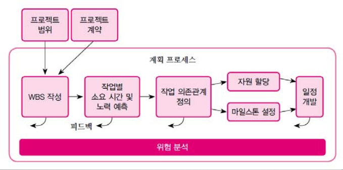
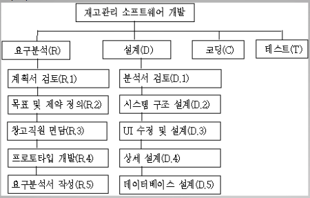
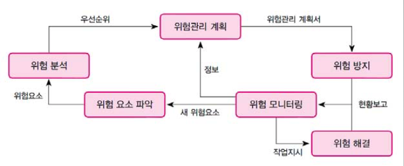

# 프로젝트 관리와 계획

## 프로젝트 관리란?

소프트웨어 프로젝트를 조직하고 계획하고 일정을 관리 하는 것이다.

## 소프트웨어 프로젝트 계획 수립

### TODO

- 소프트웨어 개발 과정과 일정, 비용, 조직, 생산 제품에 대해 사전에 계획하는 것.
- 문제를 이해하고 정의
- 필요한 소작업을 정의하고 순서를 정의
- 일정 예측
- 비용 예측
- 위험 분석

### 주의할 점

+ 시스템에 대한 충분한 이해
+ 현실적, 구체적 계획
+ 득실 관계 저울질
+ 기술적인 측면 고려

### 계획 수립의 결과 

**소프트웨어 개발 계획서**

### 계획 수립의 과정

## 개발 계획의 상세 설명

### 프로젝트 범위

계획은 대상 업무나 문제의 범위를 정하는 것으로 시작한다.

문제의 범위를 정의하기 위해 먼저 문제의 배경과 응용분야를 잘 이해해야함

+ 사용자와 면담
+ 현장 관찰
+ 실제 업무 수행해보기

#### 문제 정의

대책 수립

- 신규 시스템의 목표를 설정 (기능과 우선순위)
- 해결 방안 모색 (사용자 요구, 개발 여건, 기술적 능력 고려)

시스템 정의

- 시스템의 필요성
- 시스템의 목표 제약사항
- 시스템의 제공 기능
- 사용자의 특징
- 개발, 운용, 유지보수 환경  

#### 문제 범위 정하기

각각의 문제를 넓은 범위(싸잡아서 묶음)와 작은 범위(공통점으로 묶음)로 구분

### 개발비용 추정

- 개발 비용은 예측이 매우 어렵움
- 예산의 종류 - 인건비(**MM**), 경비, 간접 경비

비용에 영향을 주는 요소

- 제품의 크기
- 제품의 복잡도 - 응용:개발지원:시스템 = 1:3:9
- 프로그래머의 자질
- 요구되는 신뢰도 수준
- 개발 기간 - 개발비용은 개발 기간의 4제곱에 반비례

프로젝트의 비용을 예측하는 방법

- 상향식
  - 소요시간을 구하고 여기에 투입할 인력과 참여도를 곱하여 최종 인건 비용 계산
  - 소작업에 대한 비용을 일일이 예측

- 하향식
  - 프로그램의 규모를 예측하고 과거 경험을 바탕으로 소요인력과 개발 기간을 추정
  - 프로그램의 규모 - LOC, 기능점수

#### COCOMO

|      | 노력(MM)           | 기간(D)          |
| ---- | ---------------- | -------------- |
| 유기형  | $2.4KDSI^{1.05}$ | $2.5MM^{0.38}$ |
| 반결합형 | $3.0KDSI^{1.12}$ | $2.5MM^{0.35}$ |
| 내장형  | $3.6KDSI^{1.20}$ | $2.5MM^{0.32}$ |

$KDSI = LOC / 1000$
필요 개발 인원 수 : $N = MM/D$

#### 기능 점수

- 정확한 코드수는 예측 불가능
- 입력, 출력, 질의, 파일, 인터페이스의 개수로 소프트웨어의 규모를 나타냄
- 각 기능에는 가중값이 있음
- 기능 점수 1을 구현하기 위한 언어 LOC - 어셈블리 언어(324), C언어(150)
- 복합 가중값을 이용하여 기능점수 산출
- **총 라인수 = FP(기능 점수) * 원하는 언어 1점당 LOC**
- 개발 비용 = 총 라인 수 / 생산성 (LOC/MM)

기능점수의 기본 개념

- **FP = 총 기능 점수(Gross Function Point) * 보정 계수(Processing Complexity Adjustment)**
- 기능 점수는 구현 언어와 관계없는 메트릭이다.
- 기능 점수 방법은 모든 항목에 일률적 가중치가 적용됨으로 문제가 있을 수 있다.

GFP PCA 구하기

- GFP - 각 기능에 대한 복잡도(단순, 중간, 복잡)를 결정하고, 각 기능별 개수와 복잡도를 곱한 값을 더하여 구한다.

  $GFP = \displaystyle\sum_{i=1}^5(Count_i*Complexity_i)$

- PCA - 14개의 질문을 이용하여 각 처리 복잡도의 정도에 따라 0~5까지 할당하고 다음 식을 이용하여 구한다.

  $PCA = 0.65 + 0.01\displaystyle\sum_{i=1}^{14}(PC)$

### 일정 계획

- 개발 프로세스를 이루는 액티비티(소작업)를 파악하고 순서와 일정을 정하는 작업
- 개발 모형을 결정
- activity, 산출물, 이정표 설정

#### 일정 계획 세우는 순서

1. WBS(작업 분해)

   - 프로젝트 완성에 필요한 activity를 찾아냄

   - activity 관계도

     

2. CPM 네트워크 작성

   - 관리자의 일정 계획 수립에 도움
   - 프로젝트 안에 포함된 액티비티 사이의 관계
   - 소프트웨어 도구 - MS-Project, MS-Work 등

3. 최초 소요 시간을 구함

4. 소요 MM, 기간을 산정하여 CPM 수정

5. 간트 차트

### 조직 계획

#### 프로젝트의 구조

- 프로젝트별 구조 - 프로젝트 시작부터 완료까지 전담하는 팀
- 기능별 조직
  - 계획수립 분석팀, 설계 구현 팀, 테스트 및 유지보수 팀
  - Pileline 식 공정
- 매트릭스조직
  - 요원들은 고유 관리 팀과 기능 조직에 동시에 관련
  - 필요에 따라 요원을 차출 팀을 구성하고 끝나면 원래의 소속으로 복귀

#### 팀 구조

##### 책임 프로그래머 팀

- 의사 결정권이 리더에 집중

- 계층적 팀 구조

- 팀원 역할

  - 책임 프로그래머 - 제품 설계, 코어 부분 코딩, 중요한 기술적 결정, 작업의 지시
  - 프로그램 사서 - 프로그램 리스트 관리, 설계 문서 및 테스트 계획 관리
  - 보조 프로그래머 - 기술적 문제에 대해 상의, 고객, 품질 보증 그룹과 컨택, 부분적 분석/설계/구현을 담당
  - 프로그래머 - 각 모듈의 프로그래밍

- 특징
  - 의사 결정 빠름
  - 소규모 프로젝트에 적합
  - 초보 프로그래머의 훈련에 적합
- 단점
  - 리더의 능력과 경험이 프로젝트의 성패를 좌우
  - 보조 프로그래머의 역할이 모호

##### 에고레스 팀조직

- 민주주의식 의사결정
  - 구성원이 동등한 책임과 권한을 가짐
  - 자신이 있는 일을 알아서 수행
- 특징
  - 작업 만족도 높음
  - 의사 교류 활성화
  - 장기 프로젝트에 적합
- 단점
  - 책임이 명확하지 않음
  - 대규모 프로젝트에 적합하지 아니함

##### 혼합형 팀조직

- 집중형, 분산형의 단점을 보완
- 특징
  - 초보자와 경함자 분리
  - PM과 고급 프로그래머에 지휘권한이 주어짐
  - 의사교환은 초보 개발자와 중간 관리층으로 분산
- 소프트웨어 기능에 따라 계층적으로 분산됨
- 단점
  - 기술 인력이 관리를 담당해버림
  - 의사 전달 경로가 김

### 위험 관리

목적 - 위험이 발생될 때, 영향을 줄이는 것

- 위험파악

  - 인력 부족
  - 비현실적 일정 및 예산
  - 잘못된 기능의 소프트웨어 개발 - 사용자 회람, 프로토 타이핑, 조직 분석, 소프트웨어 개발서를 조기에 작성
  - 잘못된 인터페이스의 개발 - 프로토타이핑, 시나리오, 테스크 분석, 사용자 분류
  - 필요하지 않아도 좋을 기능을 추가 - 요구 삭감, 비용-수익 분석, 원가분석
  - 계속적인 요구 변경 - 최대 변경 상한선, 정보 은닉, 점증전 개발
  - 외부 모양의 빈약 - 벤치마킹, 검사, 성숙도 분석, 대조 확인
  - 외부 기능의 빈약 - 대조 확인, 사전 검증
  - 실시간 성능의 빈약 - 시뮬레이션, 벤치마킹, 모델링, 튜닝
  - 기술적 취약 - 기술 분석, 점검

- 위험분석 - 각 위험에 대한 피해 정도, 위험 해결방법, 해결방법에  대한 비용을 결정

  - 손실 발생 확률
  - 손실 발생 규모
  - 위험 노출

- 위험 우선순위 정하기

- 위험 해결

  위험 관리 계획에 명시된 위험을 줄이는 기법을 구현하고 실행하는 것

  

- 위험 모니터링

### 계획서 작성

1. 개요
   1. 프로젝트 개요
   2. 프로젝트의 산출물
   3. 정의, 약어
2. 자원 및 일정예측
   1. 자원
      1. 가. 인력
      2. 나. 비용
   2. 일정
3. 조직 구성 및 인력 배치
   1. 조직 구성
   2. 직무 기술
4. WBS
5. 기술관리 방법
   1. 변경 관리
   2. 위험 관리
   3. 비용 및 진도 관리
   4. 문제점 해결 방안
6. 표준 및 개발 절차
   1. 개발 방법론
7. 검토 회의
   1. 검토회 일정
   2. 검토회 진행 방법
   3. 검토회 후속 조치
8. 개발 환경
9. 성능 시험 방법
10. 문서화
11. 유지보수
12. 설치, 인수
13. 참고 문헌 및 부록

### 도구 고려

프로젝트 계획과 관리 도구

- 비용 추정을 위한 도구
- 일정 계획 및 진도 관리 도구
- 문서 및 버전 관리 도구