# 모델링

## 모델링

- **도메인지식**을 체계화하는 과정
- 중요한 도메인 개념과 특성, 관계를 파악하여 다이어그램으로 정형화한다.
- 모델링 과정
  ```mermaid
  graph LR
  A[도메인 분석] --> B[도메인 개념<프로세스, 기능, 역할, 규칙>]
  B --> C[기능적 모델링]
  B --> D[정적 모델링]
  B --> E[동적 모델링]
  ```

## 객체지향

### 객체지향의 개념

- 모델링이 개발자에게 주는 도움
  - 응용문제를 이해하는데 도움
  - 설계, 구현, 테스팅, 유지보수에 개념적인 기준을 제공
- 객체지향의 장점
  - 설계를 작성하고 이해하기 쉬움
  - 자료와 함수를 함께 추상화하여 변화에 영향을 적게 받음
  - 프로그램을 뚜렷하게 구별되는 단위(object)로 분할가능

- 객체지향은 주어진 문제 영역을 그 안에 존재하는 객체의 집합으로 보며, 객체들은 서로 정보를 주고 받아 상호작용

### 클래스와 객체

- 클래스 - 속성과 오퍼레이션을 캡슐화


- 객체 - 클래스의 인스턴스

### 객체와 속성

- 객체: 속성과 오퍼레이션을 가진 애플리케이션의 독립된 존재
- 속성: 객체의 특징을 결정
- 객체의 구조 = 자료구조 + 함수
- 객체는 상태(state), 능력(behaviour), 식별자(identity)를 가짐

### 캡슐화

- 정의 - 속성과 오퍼레이션을 하나로 묶고 구현 내용의 일부를 외부에 감춘다.


- 추상화의 수단
- 정보 은닉(information hiding)

### 연관(association)

- 객체는 일반적으로 상호작용하여 동작
  - 객체에 있는 서비스를 호출하면 두 객체는 관계가 이어짐
  - **상호작용할 필요가 있는지 찾아내는 작업**이 필요


- 가시성(visibility) - 객체의 접근 가능성

### 집합(agreegation)

- 집합 관계 - 전체 개념과 부분 개념 사이의 관계 A in B in C

### 상속(inheritance)

- 의미 - 한 클래스가 다른 클래스의 일반화된 개념인 경우 성립

### 다형성(polymorphism)

- 정의 - 여러 형태를 지닐 수 있다.

## UML(Unified Modeling Language)

객체지향 소프트웨어를 모델링하는 표준 그래픽 언어

- 시스템의 여러 측면을 그림으로 모델링
- 하드웨어 회로도 같은 의미

### UML 다이어그램

시스템의 모델링은 기능적 관점, 구조적 관점, 동적 관점으로 구성


| 다이어그램 | 설명                                       | 모델링 적용                                   |
| :---: | ---------------------------------------- | ---------------------------------------- |
| 사용사례  | 업무 프로세스를 나타내는 사용사례와 액터가 정점에 표시된 그래프<br>간선은 어떤 액터가 업무 프로세스와 상호작용하는지 나타냄 | 현재 존재하는 애플리케이션이나 사용자가 개발 요구한 시스템의 업무 프로세스의 개관을 나타내는데 사용<br>시스템의 범위를 나타내는데 사용 |
|  클래스  | 정점은 클래스, 방향이 있는 간선에는 클래스의 관계를 나타내는 방향성 그래프<br>정점에는 클래스가 가지고 있는 속성과 오퍼레이션 정보가 표시되어 있다. | 도메인 모델을 타나내는데 사용<br>개발자가 도메인 개념과 이들 사이의 관계를 이해하고 전달하는데 도움이 됨 |
|  시퀸스  | 장점은 객체를 나타냄<br>방향성 있는 간선은 객체 사이를 오가는 ____를 시간순으로 나타냄 | 개발팀이 현재 업무 프로세스를 이해하고 분석하는데 도움이 됨        |
|  상태   | 정점에는 시스템의 상태, 방향이 있는 간선은 상태의 변환을 나타낸 그래프 | 상태 의존적이며 반응적인 시스템의 동작을 나타내는데 사용          |
| 액티비티  | 각 정점은 정보를 처리하는 작업을 나타내며 방향이 있는 간선은 자료 및 제어 흐름을 나타내는 방향성 있는 그래프<br>제어흐름은 순차, 병렬, 동기화를 나타냄 | 시스템의 복잡한 작업 흐름을 나타내는데 사용됨                |
|  패키지  | 정점은 패키지의 묶음인 패키지, 방향이 있는 간선은 패키지의 의존관계를 나타냄 | 복잡한 클래스를 묶어서 서브시스템을 조직화하는데 사용            |
|  배치   | 정점은 분산 시스템의 물리적인 컴퓨팅 파워와 그 위에 실행되는 컴포넌트를 나타내며 간선은 네트워크 연결을 나타냄 | 배치 다이어그램은 분산 시스템의 각 컴퓨팅 노드, 컴포넌트, 커넥터 등 시스템의 물리적 자원 배치를 나타내는데 사용됨 |

### UML 모델링 과정

1. 요구를 사용사례를 정리하고 사용사례 다이어그램을 작성
2. 클래스 후보를 찾아내고 개념적인 객체 모형을 작성
3. 사용사례를 기초로 하여 시퀸스 다이어그램을 작성
4. 클래스의 속성, 오퍼레이션 및 클래스 사이의 관계를 찾아 객체 모형을 완성
5. 상태 다이어그램이나 액티비티 다이어그램 등 다른 다이어그램을 추가하여 UML모델을 완성
6. 서브시스템을 파악하고 전체 시스템 구조를 설계
7. 적당한 객체를 찾아내거나 커스텀화 또는 객체를 새로 설계


- 정적 모델 - ____의 개념이 개입되지 않은 모델
- 클래스 다이어그램이 대표적임

### 클래스 다이어그램

객체, 클래스, 속성, 오퍼레이션, 자료저장소 등을 표현

#### 클래스의 표현

- 세 개의 부분으로 나누어 맨 위는 클래스의 이름, 중간에는 클래스의 속성, 아래 부분은 오퍼레이션을 적음
- 추상클래스는 이탈릭체, 인터페이스 클래스는 << interface >>를 추가
- get/set 메서드는 생략
- 한정자 표현 +(public) -(private) #(protected)

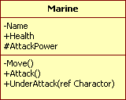

#### 일반화 관계의 표현

상속을 표현한다.

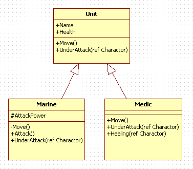

#### 실체화 관계의 표현

인터페이스를 구현하는 관계를 표현한다.

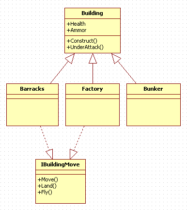

#### 연관 관계의 표현

한 객체가 다른 객체를 소유하거나, 참조하여 사용할 때 단방향과 양방향이 존재한다.

- 단방향 - 클래스간의 관계가 화살표로 구현되며, 화살표의 대상은 자신을 가리키는 클래스의 존재여부를 알지 못함
- 양방향 - 클래스간의 관계가 선으로 구현되며, 서로 연관이 되어있다.

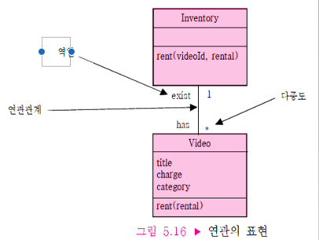

#### 집합 관계의 표현

두 클래스 사이의 전체-부분 관계를 표현한다.

- 약한 결합 - 메인 클래스가 삭제될 시, 대상 클래스는 같이 삭제가 안됨

  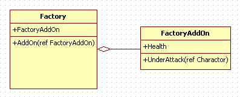


- 강한 결합 - 메인 클래스가 삭제될 시, 대상 클래스도 같이 삭제됨

  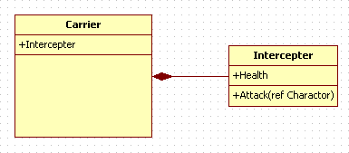

#### 클래스 찾기

- 엔티티 클래스 찾기(시스템이 유지해야 하는 데이터)
  - 사용 사례를 이해하여 사용자와 개발자가 명확히 규정한 용어
  - 사용 사례에서 반복적으로 나오는 용어(Video Tape)
  - 자주 사용하는 응용 도메인의 용어(Customer)
  - 자료 저장소 또는 단말(Scanner)


- 경계(시스템의 UI) 클래스 찾기
  - 사용자가 자료를 시스템에 입력하기 위해 필요한 양식과 윈도우를 찾음
  - 인터페이스가 어떻게 보이는지 모형화 하지 않음
  - 인터페이스를 나타내는 사용자 언어는 구현 기술과 관련 없는 용어 사용
- 제어(유스케이스를 실현) 클래스 찾기
  - 사용 사례가 복잡하여 소규모로 분할할 경우, 사용 사례 당 하나의 제어 클래스를 찾음
  - 앤티티와 경계 사이를 잇는 클래스임

#### 연관 찾기

- 연관의 속성
  - 이름 - 두 클래스 사이의 관계를 나타냄
  - 역할 - 연관 관계의 양 끝에 있는 클래스의 기능을 나타냄
  - 다중도 - 연관 관계를 나타내는 인스턴스의 개수

### 시퀸스 다이어그램

- 시스템의 동작을 정형화하고, 객체들의 메시지 교환을 울타리 형태로 시각화하여 나타낸 것

#### 객체의 표현

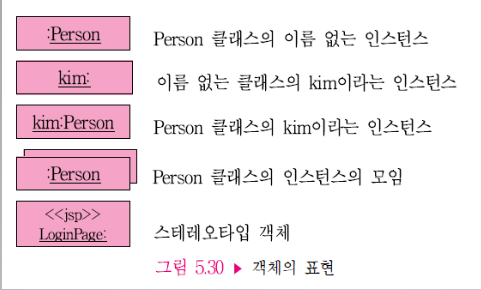

#### 요소의 표현

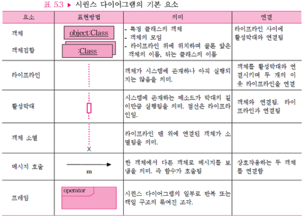

#### 시퀸스 다이어그램 작성

1. 참여하는 객체 파악
2. 파악한 객체를 x축에 나열하고 라이프라인을 그음
3. 사용 사례에 기술된 이벤트 순서에 따라 객체의 메시지를 기술

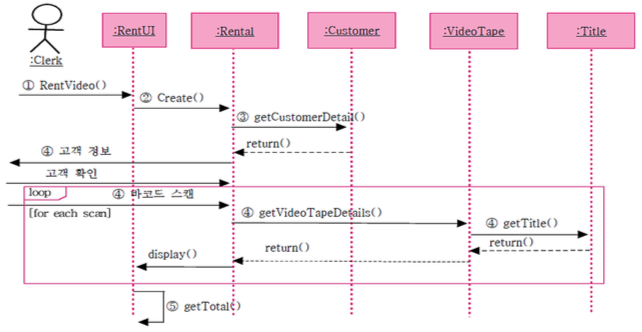

### 상태 다이어그램

복잡한 객체의 상태 변화를 나타냄

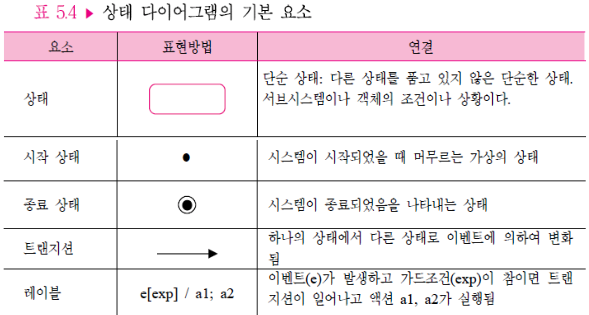

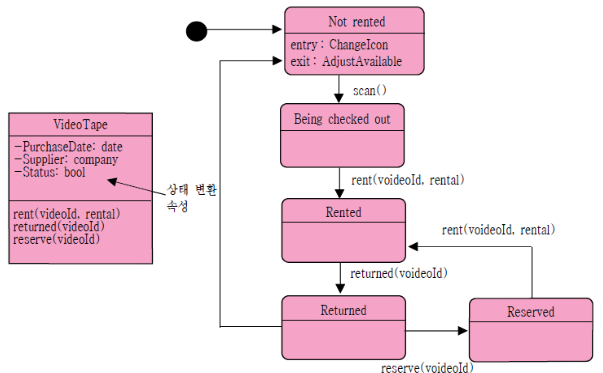

### 액티비티 다이어그램

- 시스템의 동적인 부분을 모델링 하는 목적으로 사용


- 액티비티 사이의 제어흐름을 보여주는 일종의 흐름도

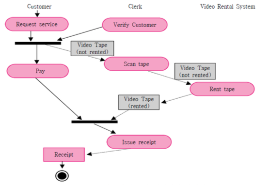