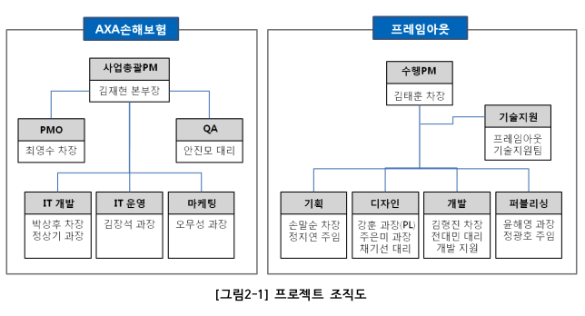

# 제안서 수정 리스트

## 제안 리스트

- 3 조직구성을 2일정예측과 순서를 스왑

- 문서 최상단에 문서 버전 기입 (v0.1)

- 표와 그림에는 주석이 달려 있어야 함

  

## 수정 리스트

- 4.1.1 image는 기본 숨김에 하이퍼링크로 연결하여 볼 수 있도록 수정
- 2.1 일정 예측을 간트차트로 변경하고 각 단계별 작업을 세분화(WBS와 일치), 상세 일정 예측표를 추가하여 내용을 늘림