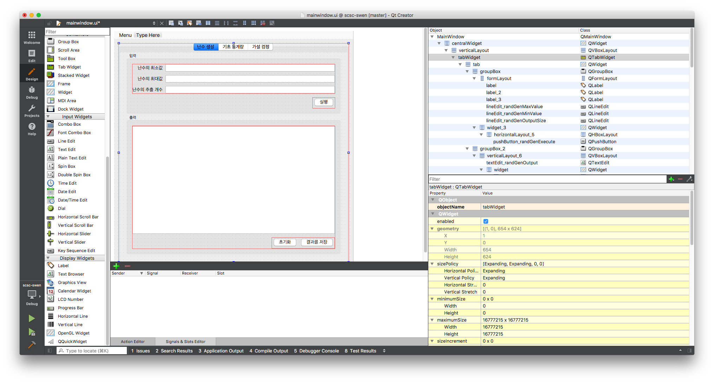
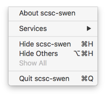
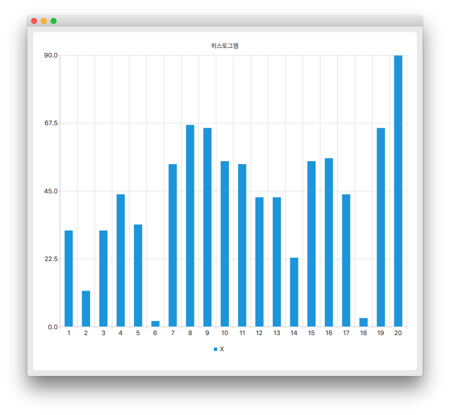
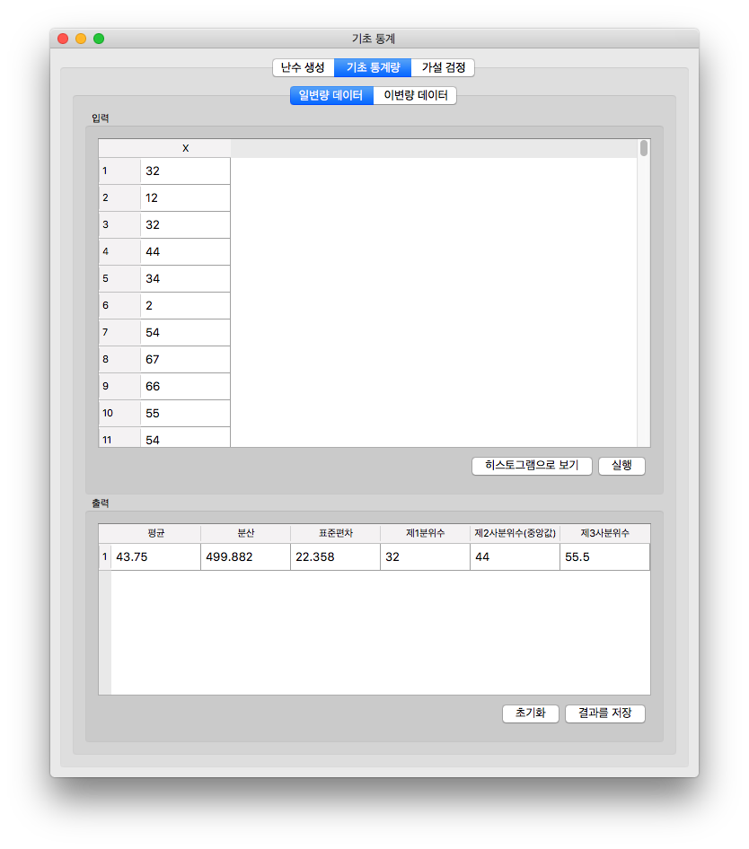
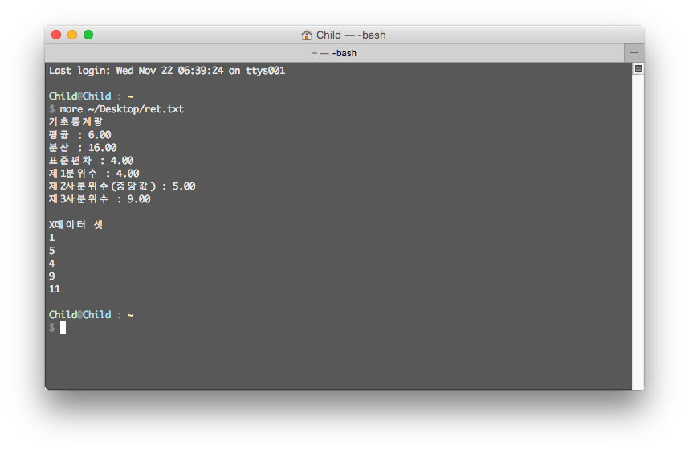
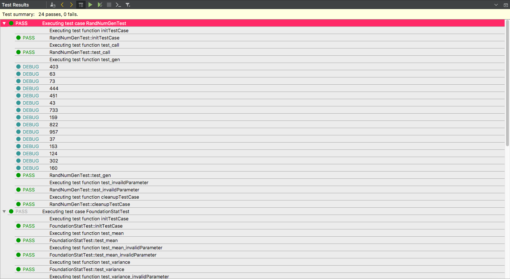
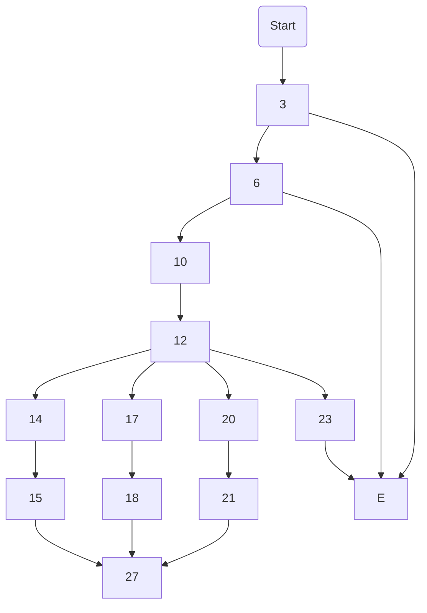

## 2. 유저 인터페이스

### 2.1 Qt의 MV(Model-View) 패턴 소개

#### MV 디자인 패턴이란?

사용자 인터페이스로부터 비지니스 로직을 분리하여 애플리케이션의 시각적 요소나 로직을 서로 영향 없이 쉽게 고칠 수 있는 애플리케이션을 만들 수 있는 디자인 패턴입니다.

- View - 사용자 인터페이스를 나타내는 요소들(버튼, 텍스트박스 등)
- Model - 애플리케이션의 비지니스 로직


### 2.2 View(mainwindow.ui)

Qt디자이너 툴을 사용하여 XML스타일의 뷰를 작성합니다. 뷰에는 윈도우, 메뉴와 같은 프레임과 레이아웃, 버튼, 텍스트박스 등과 같은 위젯의 속성을 설정합니다.




이렇게 설정된 윈도우 속성 정보들은 XML언어로 변환되어 ui확장자 파일로 Forms디렉토리에 저장됩니다.

```xml
<?xml version="1.0" encoding="UTF-8"?>
<ui version="4.0">
 <class>MainWindow</class>
 <widget class="QMainWindow" name="MainWindow">
  <property name="geometry">
   <rect>
    <x>0</x>
    <y>0</y>
    <width>680</width>
    <height>671</height>
   </rect>
  </property>
  <property name="windowTitle">
   <string>기초 통계</string>
  </property>
  <widget class="QWidget" name="centralWidget">
   <layout class="QHBoxLayout" name="horizontalLayout">
     <!-- ... 생략 -->
```

### 2.3 Model(MainWindow)

#### 2.3.0 프로그램의 시작(main.cpp)

```c++
#include "mainwindow.h"
#include <QApplication>

int main(int argc, char *argv[])
{
    QApplication a(argc, argv);
    MainWindow w;
    w.show();

    return a.exec();
}
```

프로그램이 실행되면 `MainWindow`인스턴스를 생성하고 `show`메서드로 윈도우 창을 보여줍니다.

#### 2.3.1 해더파일(mainwindow.h)

```c++
class MainWindow : public QMainWindow
{
    Q_OBJECT
public:
    explicit MainWindow(QWidget *parent = 0);
    ~MainWindow();
private:
    void init();
    void showWrongInputMessageBox();
    void saveToFile(QString text);
private:
    Ui::MainWindow *ui;
private slots:
    void showAbout();
    void quit();
    
    void genelateRandomNumber(bool checked);
    void clearRandNumberData(bool checked);
    void saveRandNumberData(bool checked);
    
    void showHistogram(bool checked);
    void calcUnivariateData(bool checked);
    void clearUnivariateData(bool checked);
    void saveUnivariateData(bool checked);
    
    void showScatterPlot(bool checked);
    void calcBivariateData(bool checked);
    void clearBivariateData(bool checked);
    void saveBivariateData(bool checked);
    
    void judgeNullHypothesis(bool checked);
    void claerNullHypothesisData(bool checked);
};
```

`MainWindow`클래스는 Qt라이브러리 모듈인 `QMainWindow`를 상속하여 구현된 경계 클래스입니다. 위 MV 디자인패턴에 대해서는  Model에 해당한다고 할 수 있습니다. 주요 부분을 중점으로 코드를 살펴보겠습니다.

##### 2.3.1.1 Q_OBJECT 매크로

```c++
class MainWindow : public QMainWindow
{
    Q_OBJECT
public:
    explicit MainWindow(QWidget *parent = 0);
    ~MainWindow();
```

`Q_OBJECT`매크로는 Qt의 컴파일러 MOC(Meta Object Compiler)에게 이 클래스가 Qt기반의 클래스임을 알려주는 역할을 하게 됩니다. 이 매크로를 사용하지 않으면, Qt관련 이벤트들이 정상적으로 수행되지 않습니다.

##### 2.3.1.2 클래스 맴버 메서드들

```c++
private:
    void init();
    void showWrongInputMessageBox();
    void saveToFile(QString text);
```

`MainWindow`클래스는 크게 일반적인 클래스 메서드와 ui에서 작성된 위젯들의 이벤트 콜백 메서드로 나뉠 수 있습니다. 위 코드는 일반적인 메서드이며 상세한 기능을 소스파일 차트에서 다루겠습니다.

##### 2.3.1.3 클래스 슬롯 맴버 메서드들

```c++
private slots:
    void showAbout();
    void quit();
    
    void genelateRandomNumber(bool checked);
    void clearRandNumberData(bool checked);
    void saveRandNumberData(bool checked);
	// ... 생략
```

`private slots` 접근 제한자에 선언된 메서드들은 ui에서 작성된 위젯들의 이벤트 콜백 메서드들입니다. 모든 이벤트 콜백 메서드들은 `slots` 접근 제한자 안에서 선언되어야 합니다.

#### 2.3.2 소스파일(mainwindow.cpp)

##### 2.3.2.1 클래스 초기화하기

```c++
MainWindow::MainWindow(QWidget *parent) :
    QMainWindow(parent),
    ui(new Ui::MainWindow)
{
    ui->setupUi(this);
    init();
}

void MainWindow::init()
{
    // 메뉴 아이템들의 클릭 이벤트를 연결합니다.
    connect(ui->actionAbout, SIGNAL(triggered()), this, SLOT(showAbout()));
    connect(ui->actionQuit, SIGNAL(triggered()), this, SLOT(quit()));

    // 난수생성 컴포넌트들의 이벤트를 연결합니다.
    connect(ui->pushButton_randGenExecute, SIGNAL(clicked(bool)), this, SLOT(genelateRandomNumber(bool)));
    
  	// .. 생략

    // 일변량 데이터 입력 테이블뷰 설정
    QStandardItemModel *model = new QStandardItemModel(TABLEVIEW_ROW_MAX_SIZE,1,this);
    model->setHorizontalHeaderItem(0, new QStandardItem(QString(TERM_X)));
    ui->tableView_univariateInput->setModel(model);

    // ... 생략
}
```

`MainWindow`클래스의 생성자는 `ui`맴버 변수를 초기화하여 유저인터페이스 설정하고 `init`메서드를 호출하여 각 위젯들의 콜백 이벤트와 `QTableView`클래스를 설정합니다. 예를 들어 난수생성ui에 배치된 실행 버튼을 클릭하였을 때, `genelateRandomNumber` 메서드가 실행되길 원한다면 위 코드의 16줄과 같이 `connect` 매서드를 사용하여 해당 버튼의 `id`속성 값과 이벤트 종류, 콜백 클래스와 메서드를 매개변수로 선언하여 이벤트를 연결할 수 있습니다.

##### 2.3.2.2 메뉴 위젯 콜백 메서드

```c++
void MainWindow::showAbout()
{
    QMessageBox::about(this, "기초 통계 프로그램",
                       "버전: 1.0"
                       // ... 생략
                       "OTHER DEALINGS IN THE SOFTWARE.");
}

void MainWindow::quit()
{
    close();
}
```

`MainWindow`의 메뉴는 About, Quit 메뉴아이템으로 이루어져 있습니다. About 이벤트가 활성화 되었을 때, `showAbout` 메서드가 호출되어 해당 애플리케이션의 정보를 보여줍니다. Quit 이벤트가 활성화 되었을 때, `quit`메서드가 호출되어 `QMainWindow::close`메서드를 다시 호출하여 애플리케이션을 정상 종료합니다.



##### 2.3.2.3 데이터를 입력받고 히스토그램 그리기

```c++
void MainWindow::showHistogram(bool checked)
{
    QAbstractItemModel* model = ui->tableView_univariateInput->model();
    dataset data;
    bool ok = extractDataset(model, 0, data);

    if(!ok)
    {
        showWrongInputMessageBox();
        return;
    }

    StatChart::histogram(data, "히스토그램", TERM_X)->show();
}
```

`QAbstractItemModel` 인스턴스 `model`변수는 `QTableView`의 데이터를 표현합니다. 따라서 `extractDataset`함수는 이러한 모델에서 `dataset`자료형으로 데이터를 추출합니다. 이 과정에서 입력에 오류가 발생한 경우 `showWrongInputMessageBox`메서드를 호출하여 사용자에게 잘못된 입력이 있음을 알립니다. 데이터들은 `StatChart::histogram`메서드로 `QCharView`인스턴스를 반환 받아 `show`메서드를 사용하여 새로운 윈도우창을 열고 히스토그램 차트를 그려 사용자에게 보여줍니다.



##### 2.3.2.4 데이터를 출력하기

```c++
bool writeUnivariateStatOutput(dataset data, QAbstractItemModel* model, int row)
{
    double mean, variance, std, q1, q2, q3;

    int ret = FoundationStat::mean(data, mean);
    ret |= FoundationStat::variance(data, variance);
    ret |= FoundationStat::standardDeviation(data, std);
    ret |= FoundationStat::pecentile(data, 0.25, q1);
    ret |= FoundationStat::pecentile(data, 0.5, q2);
    ret |= FoundationStat::pecentile(data, 0.75, q3);

    if(ret != OK)
        return false;

    model->setData(model->index(row, 0), QString::number(mean, 'f', 2));
    model->setData(model->index(row, 1), QString::number(variance, 'f',2));
    model->setData(model->index(row, 2), QString::number(std, 'f',2));
    model->setData(model->index(row, 3), QString::number(q1, 'f', 2));
    model->setData(model->index(row, 4), QString::number(q2, 'f', 2));
    model->setData(model->index(row, 5), QString::number(q3, 'f', 2));

    return true;
}
```

위 소스는 일변량 데이터를 입력받아 기초통계량을 계산하고 이를 테이블뷰에 출력하는 코드입니다. `FoundationStat`클래스의 모든 정적 맴버 클래스는 연산 중 발생한 에러에 대해 0 이외의 값을 출력합니다. 따라서 위 5줄에서 10줄까지의 코드는 반환값을 `ret`변수에 or연산하여 12줄에 에러 여부를 검사합니다. 에러가 없다면 `QAbstractItemModel`인스턴스를 통해 `QString::number`메서드로 부동소수점을 문자열로 변환시킨 데이터를 화면에 출력합니다.



##### 2.3.2.5 위젯 초기화하기

```c++
void MainWindow::claerNullHypothesisData(bool checked)
{
    ui->lineEdit_nullHypothesisTestStatistic->clear();
    ui->lineEdit_nullHypothesisStdDeviation->clear();
    ui->lineEdit_nullHypothesisSize->clear();
    ui->lineEdit_nullHypothesisTestValue->clear();
    ui->lineEdit_nullHypothesisAlpha->clear();
    ui->textEdit_nullHypothesisOutput->clear();
}
```

Qt의 위젯들은 `clear`메서드를 사용하여 입력되거나 화면에 출력한 모든 데이터를 삭제합니다.

```c++
void MainWindow::clearBivariateData(bool checked)
{
    QStandardItemModel* model = (QStandardItemModel*) ui->tableView_bivariateInput->model();
    model->setRowCount(0);
    model->setRowCount(TABLEVIEW_ROW_MAX_SIZE);
    model = (QStandardItemModel*) ui->tableView_bivariateOutput->model();
    model->setRowCount(0);
    model->setRowCount(2);
}
```

VM패턴으로 디자인된 `QTableView`인스턴스의 경우, 해당 모델 인스턴스의 행 수(row)를 0으로 설정하고 다시 원래 행수로 설정함으로써 데이터를 삭제할 수 있습니다.

##### 2.3.2.6 문자열 데이터를 파일로 저장하기

```c++
void MainWindow::saveRandNumberData(bool checked)
{
    QString text = ui->textEdit_randGenOutput->toPlainText();
    saveToFile(text);
}

...
  
void MainWindow::saveToFile(QString text)
{
    QString error;
    if(!Save::ToFile(this, text, error))
    {
        QMessageBox::information(this, "파일을 열 수 없습니다.", error);
    }
}
```

위젯에 입력된 데이터를 읽어들여와 적절하게 편집하여 `QString` 인스턴스에 저장합니다. `QString`은 Qt에서 사용하는 문자열 클래스이며, 속도향상을 위해 내부적으로 UTF-16 인코딩 문자열로 처리됩니다. `saveToFile`메서드를 호출하여 문자열 데이터를 파일로 저장하며 문제가 생길 경우 알림창으로 사용자에게 에러를 알립니다. 파일은 UTF-8 인코딩으로 저장됩니다.



## 3. 테스트

### 3.1 단위 테스트

#### 3.1.1 단위 테스트란?

소스코드의 특정 모듈이 정확히 작동하는지 테스트하기 위해 테스트 케이스를 작성하는 절차를 의미합니다. Qt라이브러리는 QtTest 라이브러리를 지원하여 단위 테스트를 쉽게 작성할 수 있습니다.

#### 3.1.2 단위 테스트 프로젝트의 구성

단위 테스트 프로젝트는 swen-test라는 별도의 단위 테스트 전용 프로젝트를 생성하여 기초통계 프로그램 애플리케이션 프로젝트를 참조하여 테스트합니다.

```bash
Child@Child : ~/qt-workspace/swen-test
$ tree
.
├── main.cpp
├── swen-test.pro
├── swen-test.pro.user
├── test-basicstat.cpp
├── test-basicstat.h
├── test-nullhypothesis.cpp
├── test-nullhypothesis.h
├── test-randnum-gen.cpp
└── test-randnum-gen.h

0 directories, 9 files
```

단위 테스트 프로젝트는 핵심 로직인 `FoundationStat`, `NullHypothesis`, `RandNumber` 클래스들을 테스트하는 `FoundationStatTest`, `NullHypothesisTest`, `RandNumGenTest` 단위 테스트 클래스들이 있습니다.

#### 3.1.3 프로그램의 시작(main.cpp)

```c++
#include <QtTest>
#include "test-randnum-gen.h"
#include "test-basicstat.h"
#include "test-nullhypothesis.h"

int main(int argc, char *argv[])
{
    int status = 0;

    RandNumGenTest t1;
    status |= QTest::qExec(&t1, argc, argv);

    FoundationStatTest t2;
    status |=QTest::qExec(&t2, argc, argv);

    NullHypothesisTest t3;
    status |=QTest::qExec(&t3, argc, argv);

    return status;
}
```

프로그램의 `main`함수 코드입니다. 각 테스트 인스턴스들을 선언하고 `QTest::qExec`메서드를 사용하여 테스트 인스턴스의 단위 테스트를 실행시킵니다. 

#### 3.1.4 해더파일(FoundationStat.h)

```c++
#ifndef MULTIVARIATEANAL_H
#define MULTIVARIATEANAL_H

#include <QtTest>

class FoundationStatTest : public QObject
{
    Q_OBJECT

private slots:
    void test_mean();
    void test_mean_invalidParameter();
    void test_variance();
    void test_variance_invalidParameter();
    void test_standardDeviation();
    void test_standardDeviation_invalidParameter();
    void test_pecentile();
    void test_pecentile_invalidParameter();
    void test_correlationCoefficient();
    void test_correlationCoefficient_invalidParameter();
};

#endif // MULTIVARIATEANAL_H
```

단위 테스트 클래스는 Qt애플리케이션과 동일하게 `QObject`클래스를 상속받고 `Q_OBJECT`매크로를 등록합니다. 그리고 테스트가 수행될 메서드들은 `private slots` 접근제한자 안에 선언합니다. 모든 테스트 메서드들의 접두사는 `test_`로 시작됩니다.

#### 3.1.5 소스파일(FoundationStat.cpp)

##### 3.1.5.1 FoundationStat::mean의 단위 테스트

```c++
void FoundationStatTest::test_mean()
{
    std::list<double> data;
    double data1 = 2.0, data2 = 1.0;
    data.push_back(data1);
    data.push_back(data2);
    double mean;
    int ret = FoundationStat::mean(data, mean);
    QCOMPARE(ret, 0);
    QCOMPARE(mean, (data1 + data2) /2);
}
```

`FoundationStat` 클래스의 `mean`메서드를 테스트합니다. 데이터를 매개변수로 입력하고 실행하여 반환값이 OK(0)을 반환하고 올바른 평균값이 계산되었는지 검사합니다. 만일 테스트가 실패할 경우 다음 테스트로 넘어가게 되고 모든 테스트가 끝난 경우 IDE를 통해 개발자에게 결과를 알려주어 테스트 여부를 알 수 있습니다.

##### 3.1.5.2 FoundationStat::mean의 잘못된 매개변수 입력 테스트

```c++
void FoundationStatTest::test_mean_invalidParameter()
{
    std::list<double> data;
    double mean;
    int ret = FoundationStat::mean(data, mean);
    QCOMPARE(ret, -1);
}
```

일부러 잘못된 매개변수를 입력하여 `mean`메서드가 방어적 프로그래밍 구현이 되어 있는지 테스트합니다. 반환값은 OK(0)이 아닌 값이 출력됩니다.

#### 3.1.6 단위 테스트 결과



총 24개의 단위 테스트를 모두 통과하였습니다.

### 3.2 화이트박스 테스트

#### 3.2.1 기본 경로 테스트

```c++
int NullHypothesis::hyphothesis(double mean, double standardDeviation, int dataSize, double testValue, double alpha, NullHypothesisSign sign)
{	
    if(dataSize < 1)
        return -1;

    if(!(0.0 <= alpha && alpha <= 1.0))
        return -1;

    int result;
    double test_statistic = (mean - testValue) / (standardDeviation / sqrt(dataSize));

    switch (sign)
    {
    case NullHypothesisSign::LESS_THEN:
        result = test_statistic >= critical_region1(dataSize, alpha) ? NULL_HYPOTHESIS_REJECT_SECCESS : NULL_HYPOTHESIS_REJECT_FAIL;
        break;
    case NullHypothesisSign::GREATER_THEN:
        result = test_statistic <= critical_region2(dataSize, alpha) ? NULL_HYPOTHESIS_REJECT_SECCESS : NULL_HYPOTHESIS_REJECT_FAIL;
        break;
    case NullHypothesisSign::NOT_EQUAL:
        result = test_statistic >= critical_region3(dataSize, alpha) ? NULL_HYPOTHESIS_REJECT_SECCESS : NULL_HYPOTHESIS_REJECT_FAIL;
        break;
    default:
        result = -1;
        break;
    }
    return result;
}
```

위 코드는 평균, 표준편차, 표본개수, 검정값, 유의수준과 부호를 사용하여 가설검정 결과를 계산하여 반환하는 메서드입니다. 이 메서드의 기본 경로를 다음의 다이어그램으로 나타낼 수 있습니다.



위 다이어그램의 기본경로는 다음과 같습니다.

| 경로                 | 설명                    |
| ------------------ | --------------------- |
| 3-6-10-12-14-15-27 | 기각역을 계산하고 귀무가설 결과를 반환 |
| 3-6-10-12-17-18-27 | 기각역을 계산하고 귀무가설 결과를 반환 |
| 3-6-10-12-20-21-27 | 기각역을 계산하고 귀무가설 결과를 반환 |
| 3-E                | 잘못된 매개변수 입력으로 에러 반환   |
| 3-6-E              | 잘못된 매개변수 입력으로 에러 반환   |
| 3-6-10-23-E        | 잘못된 매개변수 입력으로 에러 반환   |