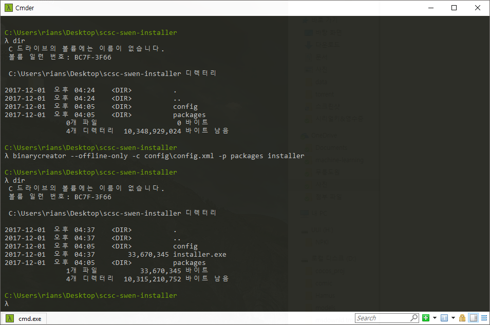

## 인수 설치

### 1. 실행 파일 만들기

#### 1.1 Release 실행으로 실행 파일 만들기


Qt5로 release모드로 빌드하여 실행파일을 생성합니다. 실행결과 Makefile과 목적파일 그리고 **scsc-swen.exe** 파일이 생성됩니다.

#### 1.2 배포용 라이브러리 추가


실행파일과 같이 프로그램 실행에 필요한 참조 라이브러리(dll)들을 추가합니다. 이 라이브러리들은 해당 Qt컴파일러의 bin디렉토리에 위치해 있습니다.


### 2. 설치 파일 만들기

배포용 설치 프로그램을 만들기 위해서 Qt installer framework를 사용합니다. Qt installer framework에서 제공하는 서비스를 사용하여 쉽게 배포용 설치 프로그램을 만들 수 있습니다.

#### 2.1 config.xml 작성하기

```xml
<?xml version="1.0" encoding="UTF-8"?>
<Installer>
    <Name>기초통계프로그램</Name>
    <Version>1.0</Version>
    <Title>기초통계프로그램 설치하기</Title>
    <Publisher>영남대학교 SCSC 소프트웨어공학 4조</Publisher>
    <TargetDir>@HomeDir@/swen-stat</TargetDir>
</Installer>
```

Qt installer framework를 사용하기 위해선 config.xml 파일을 생성하여 installer에 대한 기본적인 정보를 xml포맷으로 설정해 줄 필요가 있습니다. 

| 속성        | 설명              |
| --------- | --------------- |
| Name      | 인스톨러 패키지 이름     |
| Version   | 인스톨러 버전         |
| Title     | 상단 타이틀에 표시될 텍스트 |
| Publisher | 배포자             |
| TargetDir | 설치될 기본 디렉토리     |

#### 2.2 packages.xml 작성하기

```xml
<?xml version="1.0" encoding="UTF-8"?>
<Package>
    <DisplayName>기초통계프로그램</DisplayName>
    <Description></Description>
    <Version>1.0</Version>
    <ReleaseDate>2017-12-01</ReleaseDate>
    <Default>true</Default>
    <Script>installscript.qs</Script>
</Package>
```

또한 packages.xml 문서를 작성하여패키지의 형식으로 여러 프로그램을 한번에 설치할 수 있습니다. 지금 같은 경우에는 설치할 프로그램이 하나임으로 하나의 패키지의 정보만을 작성합니다.

| 속성          | 설명                       |
| ----------- | ------------------------ |
| DisplayName | 설치할 프로그램의 이름             |
| Description | 설치할 프로그램의 간략한 설명         |
| Version     | 버전                       |
| ReleaseDate | 배포 날짜                    |
| Default     | 설치할 패키지의 인스톨 체크박스의 체크 유무 |
| Script      | Qt에서 제공하는 인스톨러 스크립트      |

#### 2.3 설치 파일을 생성하는 도구를 실행



Qt installer framework에서 제공하는 binarycreator.exe 프로그램을 실행하여 설치파일을 만듭니다. 명령인수는 아래와 같이 입력해줍니다.

```bash
binarycreator --offline-only -c <config.xml path> -p packages <installer program name>
```

그리고 실행 후 위 터미널의 결과처럼 installer.exe(설치파일) 프로그램이 생성되었습니다.

### 3. 설치 과정

#### 3.1 설치 마법사 시작

.png)

#### 3.2 설치 디렉토리 설정

.png)

설치할 디렉토리를 설정하니다. 여기선 someDirectory 디렉토리에 설치해 보겠습니다.

#### 3.3 설치 패키지 선택

.png)

#### 3.4 시작 메뉴에 바로가기 설정

.png)

#### 3.5 설치 전 확인

.png)

#### 3.5 설치 진행

.png)

#### 3.6 설치 완료

.png)

#### 3.7 설치 완료 확인


위에 설정한 someDirectory에 정상적으로 설치됨을 확인할 수 있습니다.