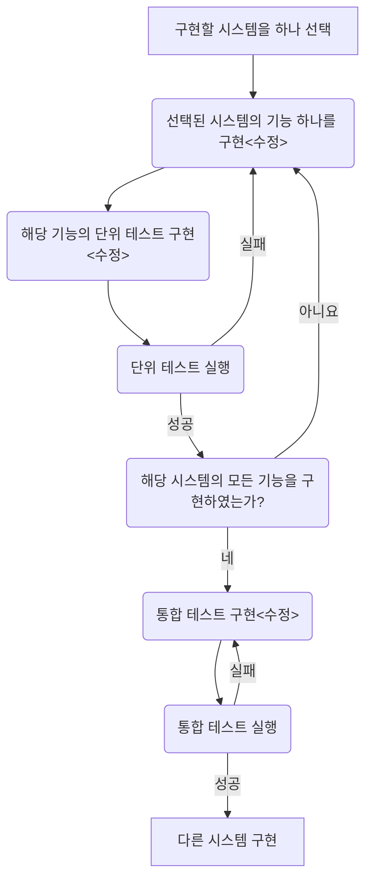

# 제안서

## 4. 개발 절차

### 4.1 개발 방법론

### 4.2 WBS

| 단계       | 작업                                       |
| -------- | ---------------------------------------- |
| 계획       | 프로젝트의 범위와 일정 확정 제안서 작성                |
| 요구분석     | 요구사항 정의 요구분석서 작성 코딩 규약, 문서 가이드 제작 프로토타입 개발 |
| 설계       | 시스템 구조 설계 UI 설계 상세 설계 설계서 작성    |
| 구현 및 테스트 | 시스템 구현 단위 테스트 통합 테스트 테스트 결과 보고서 작성 |

## 5. 위험 관리

### 5.1 프로젝트 계획

| 위험                           |  빈도  |  영향  | 대응방안                                     |
| :--------------------------- | :--: | :--: | ---------------------------------------- |
| 일정 계획 오류                     |  중   |  중   | 꾸준한 WBS 관리를 통해 일정 관리                     |
| 기술적 실현 가능성 예측 실패             |  중   |  상   | 필요한 기술을 파악하여 사전에 개발환경, 도구 등을 리서치         |
| 인력 부족 또는 비현실적 일정 과 예산의 예측 실패 |  하   |  중   | 인력을 늘릴 수 없으니, 사전에 프로젝트의 규모와 실현가능성을 면밀히 검토 |

### 5.2 분석과 설계

| 위험                    |  빈도  |  영향  | 대응방안                                     |
| :-------------------- | :--: | :--: | ---------------------------------------- |
| 요구의 모호함 또는 요구의 빈번한 변경 |  상   |  상   | 꾸준한 미팅으로 요구사항 상세하게 분석하고 변경 관리            |
| 개발 비용을 올리는 불필요한 기능 추가 |  중   |  중   | 사용자의 요구를 면밀히 분석, 필요한 경우 회의를 통해 요구를 삭감    |
| 복잡하고 모호한 설계           |  하   |  상   | 사용자의 요구를 면밀히 분석하여 아키텍처와 각 모듈간 기능을 정의, 디자인패턴을 활용하여 설계를 단순화 |

### 5.3 구현과 테스트

| 위험                                       |  빈도  |  영향  | 대응방안                                     |
| :--------------------------------------- | :--: | :--: | ---------------------------------------- |
| 필요한 기술을 가진 인력을 프로젝트에 참여를 못하거나, 교육할 수 없는 경우 |  하   |  상   | 사전에 구현에 대한 작업을 분할하고, 프로젝트에 사용될 프레임워크에 대한 교육이 선행되도록 한다. |
| 협업의 과정에서 개발, 코드관리가 힘든 경우                 |  상   |  중   | 형상 관리 도구를 사용하여 개발 버전을 일원화, 설계된 인터페이스를 활용, 사전에 코딩규약을 약속 |
| 실시간 성능이 빈약                               |  하   |  하   | 시뮬레이션을 통해 부하가 걸리는 지점과 원인을 분석             |
| 빌드와 추출 실패                                |  상   |  하   | 빌드가 실패되는 원인을 분석, 팀원간 개발환경과 GUI 프레임워크 버전, 컴파일러 버전을 통일 |
| 잠재적인 논리 오류                               |  상   |  상   | 컴파일러와 IDE가 제공하는 정적검증 체크, 동적 검증, 테스트 주도 개발 도구를 사용하여 검증 |
| 테스트 시나리오 오류                              |  상   |  중   | 테스트 시나리오 검증, 오류 발견시 시나리오 재작성             |

### 5.4 기타 위험요소

| 위험     |  빈도  |  영향  | 대응방안                                    |
| :----- | :--: | :--: | --------------------------------------- |
| 산출물 오류 |  중   |  중   | 각 단계별로 프로세스가 끝난 뒤 산출물 검토, 오류 발견 시 즉시 정정 |

## 6. 품질 관리

### 6.1 품질보증 방안

- 품질관리 담당 인원이 별도로 주기적으로 모니터링
- 검토회에서 심의 결과에 따른 프로젝트 품질 보정을 실시
- 변경부분과 최신 버전을 형상 관리 도구로 기록
- 테스트 도구를 사용하여 품질 검증

### 6.2 검토 회의

~~여기에 7.1 7.2 7.3 내용 넣기~~

### 6.3 테스트와 검증 계획

#### 6.3.1 테스트와 검증 항목

1. 단위 테스트 : 단위 테스트로 기능을 시험
2. 통합 테스트 : 시스템간 연동 및 전체 기능을 시험
3. 동적 검증 : 실제 프로그램을 실행 시켜 기능 검증
4. 정적 검증 : IDE, 컴파일러 또는 외부 검증 도구가 제공하는 서비스 활용하여 검증

#### 6.3.2 테스트 일정

| 종류     | 일정                                   | 비고   |
| ------ | ------------------------------------ | ---- |
| 단위 테스트 | 구현 단계에서 기능 구현과 동시에 테스트코드 작성하고 즉시 검증  | TDD  |
| 통합 테스트 | 구현 단계에서 시스템 구현과 동시에 테스트코드 작성하고 즉시 검증 |      |

#### 6.3.3 테스트 절차 플로우 차트

## 7. 형상 관리

### 7.1 형상 관리 대상

| 산출물              | 비고        |
| ---------------- | --------- |
| 제안서              | 기획 산출물    |
| 요구사항 명세서         | 기획 산출물    |
| 계획서              | 기획 산출물    |
| 설계 문서            | 기획 산출물    |
| 테스트 결과 보고서       | 기획/구현 산출물 |
| 소프트웨어 소스와 테스트 코드 | 구현 산출물    |
| 메뉴얼 문서           | 기획 산출물    |

### 7.2 형상 관리 절차

1. 변경 사항 발생
2. 팀원과 변경 사항에 대해 의사 교류 (카카오톡, 이메일, 대면 보고로 요청)
3. 변경 여부 결정
4. 변경
5. 검토 및 테스트 (테스트는 구현과 테스팅 부분에 해당)
6. 버전 관리

### 7.3 형상 관리 규칙

- 검수 이전의 문서 버전은 0.1로 시작하여, 변경 시 0.1 증가시켜 기록
- 프로그램 소스코드 및 테스트 코드은 변경 후, log에 변경사항 상세 기록
- 프로그램 소스코드 및 테스트 코드은 변경 후에도 반드시 빌드가 성공함을 보장해야함

### 7.4 형상 관리 도구

#### 7.4.1 소스코드 형상 관리 도구

- git
- [Github](https://github.com/)

#### 7.4.2 문서 형상 관리 도구

- Google Drive

## 8. 개발 환경

### 8.1 소프트웨어 자원

| Type          | Spec              |
| ------------- | ----------------- |
| OS            | Windows 10, MacOS |
| IDE           | Qt Creator 5.9    |
| Charater set  | UTF-8             |
| Complier tool | qmake, make       |

## 9. 성능 시험 방법(생략)

~~통계 프로그램 개발에 성능 시험은 불필요~~

## 10. 문서화

### 10.1 프로젝트 산출 문서(수업 계획서 기준)

| 단계          | 프로젝트 산출물   |
| ----------- | ---------- |
| 계획          | 제안서        |
| 요구분석        | 요구사항 명세서   |
| 설계          | 계획서        |
| 상세 설계와 UI설계 | 설계 문서      |
| 유지보수        | 테스트 결과 보고서 |

### 10.2 API 문서

Doxygen을 사용하여 API 문서를 작성

## 11. 유지보수

### 11.1 버그 픽스

고객과 똑같은 환경을 구축

소스 버전을 확인하고 관리

- git 도구 사용
- 설치된 버전을 확인할 수 있도록 패키징

해당 버전의 종속적인 라이브러리를 관리

- 별도의 설치본을  저장소에 보관

### 11.2 문서 배포

- 버전
- 설치, 사용 설명서
- 변경 내역
- 라이센스

### 11.3 기타 고려해야 할 점

- 자동화 - 일련의 배포 과정이 번거롭다면 자동화도 고려
- 쉬운 디버깅 - 로그, 디버깅 도구 사용
- 문서 - 개발 계획서, 요구분석서, 설계서 또한 버전에 맞추어 업데이트

## 12. 설치

### 12.1 지원하는 운영체제

- Windows 7, 10
- MacOS 10.12

### 12.2 배포 방법

- release in github repository
- 무설치 포터블 방식

## 13. 참고 문헌 및 부록

[유지보수를 고려한 소프트웨어 개발](https://www.slideshare.net/dhrim/sw-12250135)

[프로젝트 계획서 양식](https://www.google.co.kr/url?sa=t&rct=j&q=&esrc=s&source=web&cd=1&ved=0ahUKEwik47Wd_KPWAhVBu5QKHUH0CGcQFgglMAA&url=http%3A%2F%2Fwww.kipfa.or.kr%2FCommon%2FAttachFileDown.aspx%3Ffolder%3D%2FWebAward%2FAttachFile%2F12%2F%26filename%3Dw_20121011102423935734459.doc&usg=AFQjCNGCNAA9MFO5eyNiYSfLllTivD1wAg)